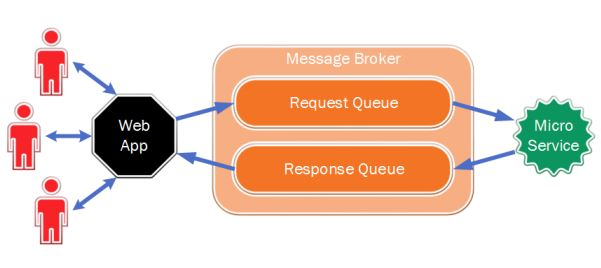

**Heads up!** I want to preface this by saying that I'm looking for a _transition_ role to get more intense experience with microservice architecture and CI/CD.  I have ~22 years of full stack development experience with console/desktop/web apps, services, APIs, databases, integration, etc in both IC and lead roles, but I'm fairly new to microservices.  I expect to ramp quickly by leveraging my broad experience, but I do not want to present myself as an expert.  Therefore, some of these answers are based on research, not experience.

# Task 1 - Troubleshooting

You have developed a multi-threaded Windows service.  QA suspects this service is leaking memory.

## How would you verify QA's claim?

Assuming no third party debugging tools are available, run the service in Visual Studio and use the Diagnostic Tools to review memory usage. Alternatively, use perfmon Memory/Committed Bytes, Process/Private Bytes, and similar counters.  Look for steadily increasing memory usage and/or spikes.

## How would you debug your service?

Run it within Visual Studio under enough load to reproduce the leak, then take a few memory snapshots as usage is increasing.  Sort the heap size view by descending object size and look for objects that are consistently increasing in size.  The object type will hopefully point you in the right direction.

## How would you identify the leaking thread?

Hmmm.  Short of logging thread IDs once I found suspect code as described above, I'm not sure.


# Task 2 - General Programming

Consider the following part of a class:

```cs
public static SqlConnection Conn
{
    return "Data Source=.;Initial Catalog=NorthWind;Integrated Security=True";
}

public void ShowFirstTenUsers()
{
    using (SqlCommand command = new SQLCommand(Conn))
    {
        command.CommandText = "Select * from Users limit 10";

        SqlDataReader reader = command.ExecuteReader();

        try
        {
            while (reader.Read())
            {
                Console.WriteLine(String.Format("{0}, {1}", reader[0], reader[1]));
            }
        }
    }
}
```

## What logical/syntax problems do you see?

+ Property `Conn` is missing `get` accessor
+ Property `Conn` is returning a string, not a SqlConnection
+ `SQLCommand` should be `SqlCommand`
+ `SqlCommand` has no constructor that takes only a `SqlConnection` object
+ `SqlConnection` is never opened
+ `try` is not `catch`ed or `finally`ed
+ SQL Server syntax is `SELECT TOP 10` not `LIMIT 10`

## How can you improve performance of this code under high load?

+ Reduce `SELECT` to only fields required
+ Specify an appropriate locking strategy
+ Ensure database connection is always closed as soon as possible
+ Cache results to avoid excessive lookups

## How can you minimize schema change failures?

+ Modify `SELECT` to target the specific two fields you want

## How can you improve exception handling?

+ Add `catch`es for various exception types to distinguish types of errors
+ Add log4net, Elmah, or similar logging package
+ Close database connection in `finally` or (better) wrap in `using`


# Task 3 - Asynchronous Programming (1 of 2)

Consider the following function:

```cs
async Task SecurityGetSocialNetwork (MobileRequest request, Result<object> result)
{
    ProdEvents.Mobile.RoutedToWorker("SecurityGetSocialNetworkUrl");

    var socialNetwork = SecurityConverters.GetLoginInfo(request);

    var data = ProdConfiguration.SocialNetworks
        .Where(sn => sn.SocialNetworkID == socialNetwork)
        .Select(sn => new {Url = sn.ProfileCallURI,
            Field = sn.ProfileIDField,
            Timeout = sn.TimeoutRequest,
            CustomData = sn.CustomData })
        .First();

    result.Data = data;
    result.ResultCode = (int)CoreCodes.NoError;
    result.RequestContext = request.RequestContext;
}
```

## What bugs do you see?

+ `async` implies asychronous, but there is no `await` statement, so method will run asynchronously
+ `First()` assumes there will always be a result
+ `Result` seems to be an output parameter, but it's not flagged as `out` and will cause an exception if null
+ No error handling

## How would you fix them?

Assuming Result is a generic defined as:

```cs
public class Result<T>
{
    public T Data { get; set; }
    public CoreCodes ResultCode { get; set; }
    public object RequestContext { get; set; }
}
```

And GetLoginInfo() is an awaitable I/O bound operation, then:

```cs
async Task<Result<object>> SecurityGetSocialNetworkAsync(MobileRequest request)
{
    ProdEvents.Mobile.RoutedToWorker("SecurityGetSocialNetworkUrl");

    var result = new Result<object>
    {
        ResultCode = (int)CoreCodes.NoError,
        RequestContext = request.RequestContext
    };

    try
    {
        var socialNetwork = await SecurityConverters.GetLoginInfo(request);

        result.Data = ProdConfiguration.SocialNetworks
            .Where(sn => sn.SocialNetworkID == socialNetwork)
            .Select(sn => new {
                Url = sn.ProfileCallURI,
                Field = sn.ProfileIDField,
                Timeout = sn.TimeoutRequest,
                CustomData = sn.CustomData
            })
            .FirstOrDefault();
    }
    catch
    {
        result.ResultCode = (int)CoreCodes.Error;
    }

    return result;
}
```


# Task 4 - Asynchronous Programming (2 of 2)

Given the following class:

```cs
class TestAsync
{
    public async void RetrievePage(string url)
    {
        Task<string> getPageTask = GetPage(url);

        Console.WriteLine("Point 1");
        string page = await getPageTask;
        int length = page.Length;
        Console.WriteLine("Point 2");
    }

    private async Task<string> GetPage(string url)
    {
        Task<string> getString = (new HttpClient()).GetStringAsync(url);

        Console.WriteLine("Point 3");
        string webText = await getString;
        Console.WriteLine("Point 4");
        return webText;
    }
}
```

## What would invoking RetrievePage do?

1. Invoke GetPage() asynchronously
1. GetPage invokes GetStringAsync and continues
1. GetPage writes "Point 3", then returns control to RetrievePage
1. RetrievePage writes "Point 1" and returns control to caller while waiting for GetPage to complete
1. When getString completes, GetPage writes "Point 4" and returns the value
1. RetrievePage records the length of the returned string and writes "Point 2"

## How would you invoke it?

```cs
new TestAsync().RetrievePage("http://www.google.com");
```

## How many threads would be involved in this call?

One

## What would be printed to the console?

1. Point 3
1. Point 1
1. Point 4
1. Point 2


# Task 5 - Design/Architecture (1 of 3)



A Web Application accepts requests from a number of clients. It submits the requests into the Request Queue. A Microservice receives requests, processes them, and submits results into the Response Queue. The Web Application receives responses and forwards them to the corresponding clients.

## What possible logical problems do you see in this design?

1. Requests must be correlated to responses so the web app handler only acts on a response to the request it submitted
1. If the web server instance fails after publishing to the queue, it will be unavailable to receive the response
1. The web server request handler must wait for the correct response to appear in the queue
1. There is no retry process

## What possible performance problems do you see in this design?

1. The web server could submit requests to the queue faster than the microservice can process them

## How would you address these problems?

With regard to correlation, you could either use shared queues and a correlation ID (e.g. web session ID or similar) to associate requests and responses, or use a transient queue for each web request.  In either case, the web methods should be async to avoid blocking and allow for better scaling.

However, I'd lean toward a fire-and-forget pattern, where the web app publishes to the Request Queue and then immediately returns a correlation ID to the client, which then begins polling an API for status.  When the microservice is done, it publishes to the Response Queue, where some other service records status to shared storage (memcache, database, etc).  At the next polling interval, the web server returns a "completed" status to the client along with any other job detail it requires.  Websockets could be used instead of polling, but polling will work in a load-balanced environment and lowers overall complexity.

I'd also set up a retry strategy so jobs could auto-retry a certain number of times before a failure message is published.

# Task 6 - Design/Architecture (2 of 3)

You are developing a large distributed system with 50 different services exposing and consuming RESTful APIs.  Multiple teams are working on different services.

## How would you make sure a change in one service does not break the others?

Implement a versioning strategy based on URL or HTTP header so clients must be updated to invoke the new version.

## How can you make sure an old version of consumer never invokes a new version of API?

A URL or HTTP header strategy would prevent this because the consumer would need to be updated to access the new URL or add the updated header.

## What is your strategy to roll out updated APIs in production?

Automate deployment of containers to ensure consistency and reduce downtime.

## How would you secure your RESTful APIs?

1. Use SSL secured endpoints
1. Use CORS to target specific browser consumers
1. Only expose public services outside the firewall
1. Use OAuth and JWT for user authorization


# Task 7 - Design/Architecture (3 of 3)

You are developing a multi-threaded service that scans a designated directory structure, reads new or updated files, and writes them into a database.

## What tasks performed by this service would be suitable for multi-threaded operations?

1. Scanning the directory structure (e.g. one per root folder or similar strategy)
1. Writing files to the database

## What possible performance issues should you consider when designing this service?

1. Network performance if remote directory structure and/or database are remote
1. Database server performance

## What possible I/O-related issues should you consider when designing this service?

1. Files could be deleted/updated/renamed before or during a database write operation
1. Files could be updated more frequently than they can be written to database

# Task 8 - Hands-On Test

Design and implement an application that generates or accepts as input a list/array of random numbers, and uses the merge sort algorithm to perform an ascending sort of the list/array elements.

+ Use C# as implementation language
+ Utilize multithreading to speed up sorting
+ Employ behavior-driven development.

See the Visual Studio solution at Task8_MergeSort/MergeSort.sln